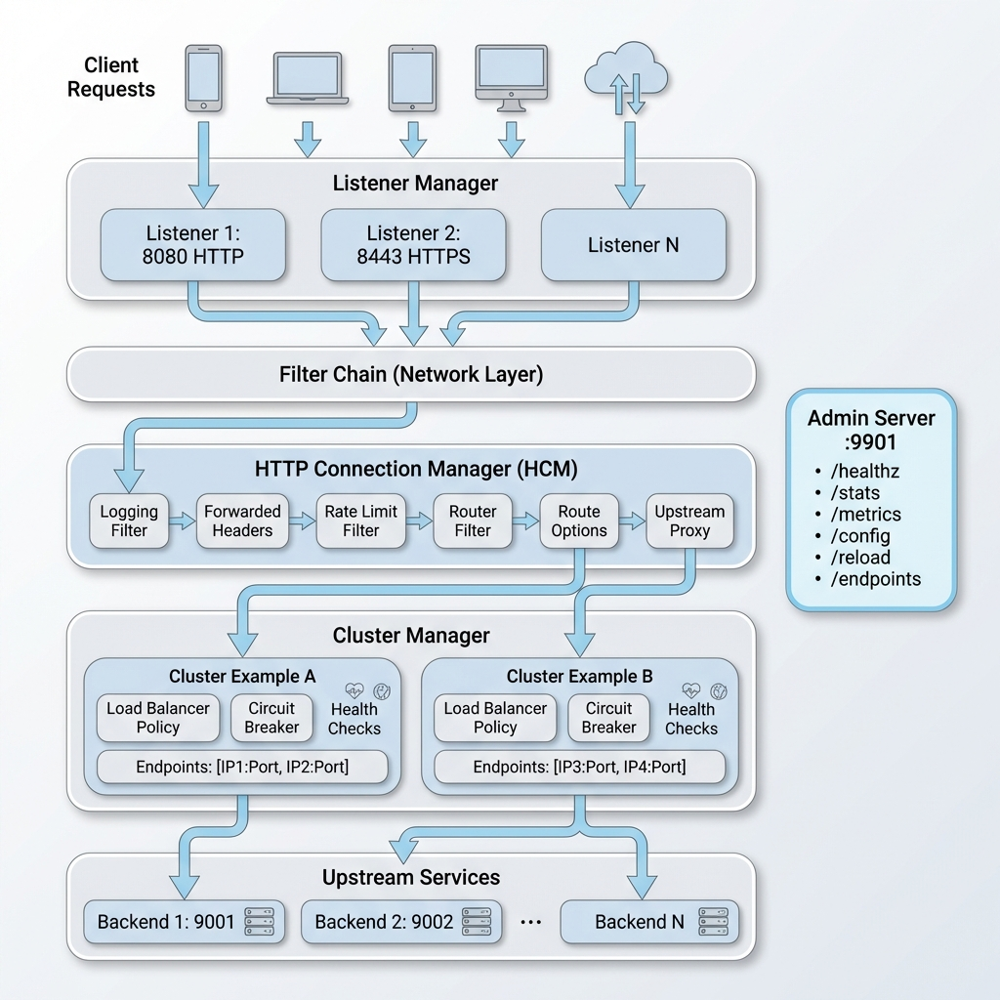
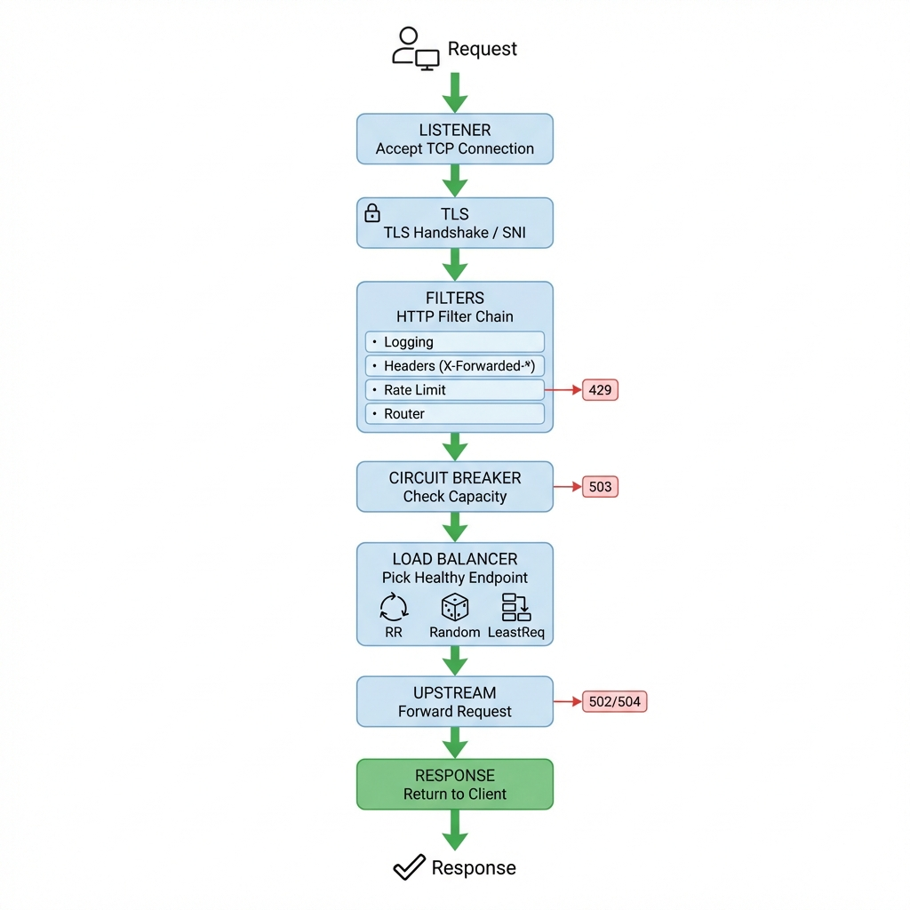
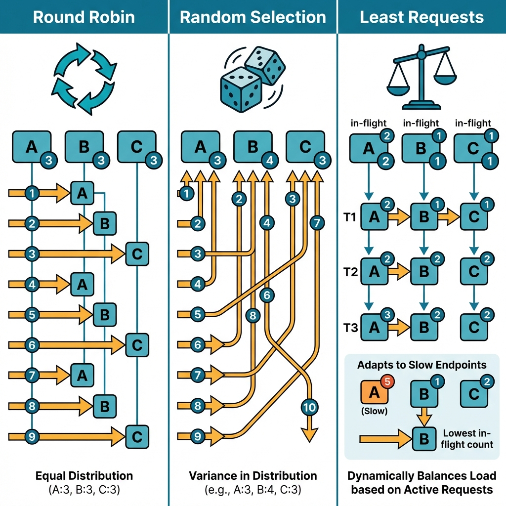
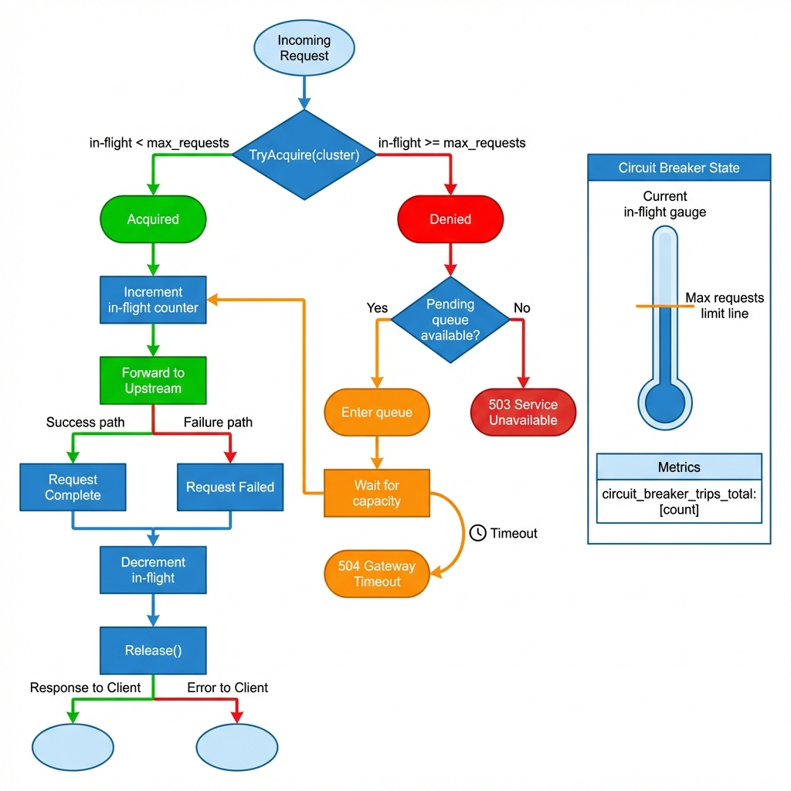
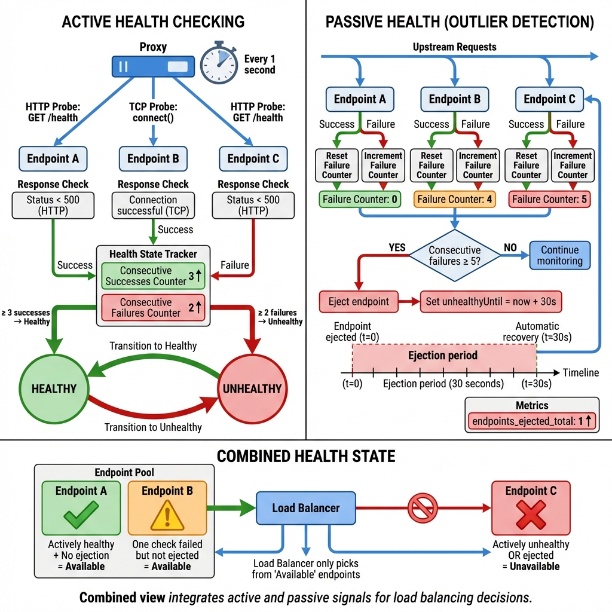
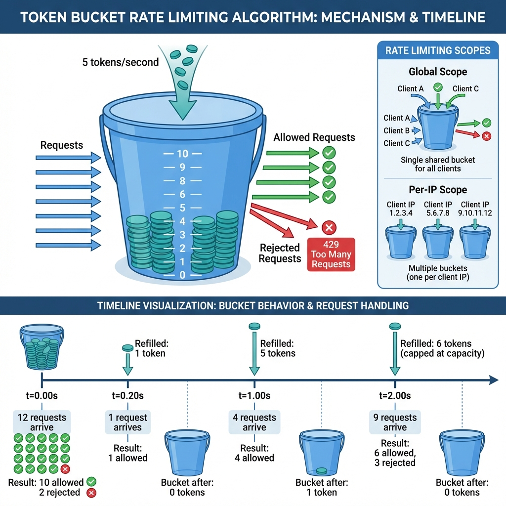
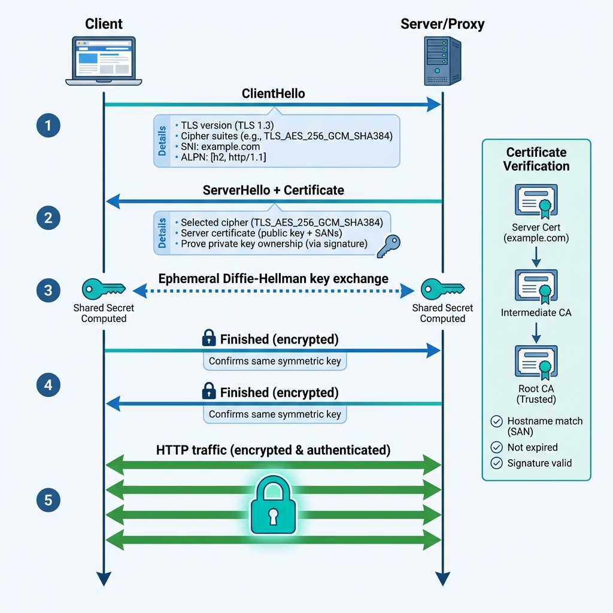
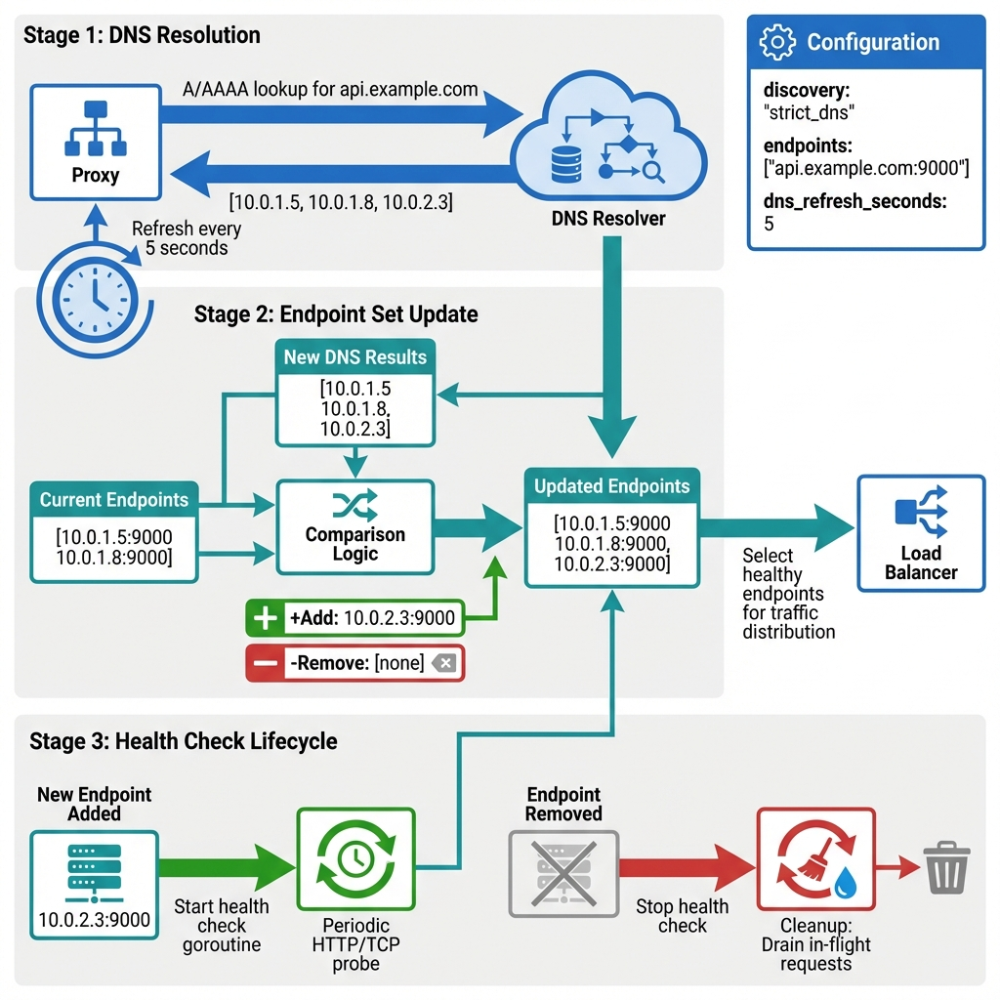

# Go-Proxy

> **A production-grade HTTP/HTTPS reverse proxy and load balancer built in Go**  
> Learn how systems like Envoy, NGINX, and HAProxy work under the hood

---

## What is Go-Proxy?

Go-Proxy is a **learning-focused implementation** of a modern reverse proxy that demonstrates real-world distributed systems patterns. Think of it as a traffic cop that sits between your users and your backend services:

```
Users → Go-Proxy → Backend Services
```

**Why use a reverse proxy?**

- **Load balancing** — distribute traffic across multiple servers
- **Security** — TLS termination, hide backend topology
- **Resilience** — circuit breakers, retries, health checks
- **Observability** — unified metrics and logging

### Core Capabilities

| Feature | Description |
|---------|-------------|
| ✅ Multi-listener support | HTTP/HTTPS on different ports |
| ✅ TLS termination | With SNI and optional mTLS |
| ✅ HTTP/1.1 and HTTP/2 | Full protocol support |
| ✅ Load balancing | Round Robin, Random, Least Requests |
| ✅ Circuit breaking | Concurrency limits with fast-fail |
| ✅ Health checking | Active (HTTP/TCP) and passive (outlier detection) |
| ✅ Rate limiting | Token bucket (global and per-IP) |
| ✅ Request routing | Path matching with rewriting |
| ✅ Retry policies | Exponential backoff with jitter |
| ✅ Hot reload | Update config without dropping connections |
| ✅ Observability | Prometheus metrics, access logs |
| ✅ Service discovery | DNS-based (strict DNS) |

---

## Quick Start

### Prerequisites

- [Go](https://go.dev/) 1.21 or higher

### Run the Proxy

```bash
# Clone the repository
git clone https://github.com/mayurvarma14/go-proxy.git
cd go-proxy

# Generate self-signed TLS certificate (required for HTTPS)
openssl req -x509 -newkey rsa:4096 -keyout server.key -out server.crt \
  -days 365 -nodes -subj "/CN=localhost"

# Run with default config
go run cmd/proxy/main.go --config config/dev.yaml
```

The proxy starts with:

- **HTTP Listener**: Port `8080`
- **HTTPS Listener**: Port `8443`
- **Admin Server**: Port `9901`

### Verify It Works

```bash
# Check health
curl localhost:9901/healthz
# Output: ok

# Start a test backend
python3 -m http.server 9003 &

# Make a request through the proxy
curl -v localhost:8080/
```

---

## System Architecture



Go-Proxy follows a **layered architecture** where each layer has a specific responsibility:

### High-Level Components

#### 1. Listener Manager

- Accepts incoming TCP connections on configured ports
- Handles TLS termination for HTTPS traffic
- Routes connections through filter chains
- Supports graceful shutdown and connection draining

#### 2. Filter Chains

- **Network Layer**: Processes raw TCP connections
- **HTTP Layer**: Parses HTTP requests and applies filters:
  - Logging Filter
  - Forwarded Headers (X-Forwarded-*)
  - Rate Limiting
  - Router (path matching)
  - Upstream Proxy (forwarding)

#### 3. Cluster Manager

- Manages pools of upstream endpoints (clusters)
- Implements load balancing policies
- Tracks endpoint health (active and passive)
- Enforces circuit breakers
- Handles service discovery

#### 4. Admin Server (:9901)

| Endpoint | Description |
|----------|-------------|
| `/healthz` | Health check |
| `/stats` | Human-readable metrics |
| `/metrics` | Prometheus format |
| `/config` | Current configuration |
| `/reload` | Hot reload trigger (POST) |
| `/endpoints` | Endpoint health status |

---

## Request Processing Pipeline

Every request flows through 7 distinct stages:



### Step-by-Step Flow

| Step | What Happens |
|------|--------------|
| **1. Connection** | Listener accepts TCP connection |
| **2. TLS** | TLS handshake, extract SNI hostname |
| **3. Filters** | HTTP filter chain: logging → rate limit → router |
| **4. Circuit Breaker** | Check cluster capacity (503 if full) |
| **5. Load Balancer** | Pick healthy endpoint |
| **6. Upstream** | Forward request to backend |
| **7. Response** | Stream response back, handle retries on failure |

### Filter Chain Details

| Filter | Purpose |
|--------|---------|
| **Logging** | Log request details |
| **Forwarded Headers** | Add X-Forwarded-For, X-Forwarded-Proto, Via, X-Request-ID |
| **Rate Limiter** | Check token bucket → 429 if limited |
| **Router** | Match path → set cluster, compute rewrite |
| **Upstream Proxy** | Forward to backend |

---

## Configuration

Go-Proxy uses YAML or JSON configuration. The config has three main sections:

### Listeners

Define where the proxy accepts connections:

```yaml
listeners:
  - name: http_main
    address: 0.0.0.0:8080
    filter_chains:
      - name: basic
        filters: ["logging", "hcm"]
        
  - name: https_main
    address: 0.0.0.0:8443
    tls:
      cert_path: ./server.crt
      key_path: ./server.key
      min_version: "1.2"
    filter_chains:
      - name: default
        filters: ["hcm"]
      - name: sni_app
        sni_hosts: ["app.example.com"]
        filters: ["logging", "hcm"]
```

### Routes

Map URL paths to backend clusters:

```yaml
routes:
  - prefix: /svc1
    cluster: service1
    prefix_rewrite: /
    
  - prefix: /svc-dns
    cluster: dns_svc
    prefix_rewrite: /
    
  - prefix: /
    cluster: default
    strip_prefix: true
```

### Clusters

Define backend services and their behavior:

```yaml
clusters:
  - name: service1
    endpoints: ["127.0.0.1:9001", "127.0.0.1:9002"]
    lb_policy: least_requests
    
    circuit_breaker:
      max_requests: 5
      
    health_check:
      type: http
      http_path: /
      interval_ms: 2000
      healthy_threshold: 1
      unhealthy_threshold: 2
      
    outlier:
      consecutive_failures: 3
      ejection_seconds: 30
      
    retry_policy:
      max_retries: 1
      per_try_timeout_ms: 1200
      idempotent_only: true
      backoff_base_ms: 100
      backoff_max_ms: 500
```

---

## Load Balancing

Go-Proxy supports three load balancing algorithms:



### Algorithms Comparison

| Algorithm | How It Works | Best For |
|-----------|--------------|----------|
| **Round Robin** | Cycle: A → B → C → A... | Homogeneous backends |
| **Random** | Pick randomly from healthy | Large pools, stateless |
| **Least Requests** | Pick endpoint with fewest in-flight | Variable response times |

### Round Robin

```
Requests:  1  2  3  4  5  6  7  8  9
Endpoints: A  B  C  A  B  C  A  B  C
```

### Random

```
10 picks: B C B A B A C C A B
Distribution: A=3, B=4, C=3 (some variance expected)
```

### Least Requests

```
Current in-flight: A=1, B=1, C=5
Next request → pick A or B (lowest)
```

**Key insight**: All policies automatically skip unhealthy endpoints.

---

## Resilience Patterns

### Circuit Breakers

**Purpose**: Protect backends from overload by limiting concurrent requests.



**How it works**:

| Condition | Action |
|-----------|--------|
| in-flight < max_requests | Proceed |
| in-flight ≥ max_requests | Return 503 immediately |

**Configuration**:

```yaml
circuit_breaker:
  max_requests: 50        # Cluster-level limit
  per_endpoint_max_requests: 100  # Per-endpoint limit
```

**Tuning formula**:

```
max_requests ≈ target_RPS × average_latency_seconds
Example: 200 RPS × 0.1s = 20 concurrent requests
```

### Health Checking



#### Active Health Checks

The proxy periodically probes each endpoint:

```yaml
health_check:
  type: http           # or "tcp"
  http_path: /health
  interval_ms: 2000    # Check every 2 seconds
  timeout_ms: 800
  healthy_threshold: 1   # 1 success → mark healthy
  unhealthy_threshold: 2 # 2 failures → mark unhealthy
```

- **HTTP**: Success if status < 500
- **TCP**: Success if connection established

#### Passive Health (Outlier Detection)

Monitors actual request failures and automatically ejects consistently failing endpoints:

```yaml
outlier:
  consecutive_failures: 3   # 3 failures in a row → eject
  ejection_seconds: 30      # Auto-recover after 30s
```

### Retry Policies

Automatically retry failed requests:

```yaml
retry_policy:
  max_retries: 1
  per_try_timeout_ms: 1200
  idempotent_only: true       # Only retry GET/HEAD/etc
  backoff_base_ms: 100
  backoff_max_ms: 500
```

**Backoff formula**: `wait = min(base × 2^attempt + jitter, max)`

---

## Rate Limiting

Go-Proxy uses the **token bucket** algorithm for rate limiting:



### How Token Bucket Works

| Parameter | Description |
|-----------|-------------|
| `rps` | Tokens refilled per second |
| `burst` | Maximum bucket capacity |
| `scope` | `global` or `ip` |

**Logic**:

```
if tokens >= 1:
    tokens -= 1 → ALLOW
else:
    → DENY with 429 Too Many Requests
```

### Configuration

```yaml
rate_limit:
  rps: 1000      # Steady-state rate
  burst: 1000    # Allow short bursts
  scope: global  # or "ip" for per-client limiting
```

### Timeline Example

**Config**: `rps=5, burst=10`

| Time | Bucket | Arrivals | Allowed | Denied |
|------|--------|----------|---------|--------|
| 0.00s | 10 | 12 | 10 | 2 |
| 0.20s | 1 | 1 | 1 | 0 |
| 1.00s | 5 | 4 | 4 | 0 |
| 2.00s | 6 | 9 | 6 | 3 |

---

## TLS & Security



### TLS Guarantees

| Promise | Meaning |
|---------|---------|
| **Confidentiality** | Data is encrypted |
| **Integrity** | Data is tamper-evident |
| **Authenticity** | Server identity verified |

### TLS 1.3 Handshake Steps

1. **ClientHello**: TLS version, ciphers, SNI, ALPN
2. **ServerHello + Certificate**: Selected cipher, server cert
3. **Key Exchange**: Ephemeral Diffie-Hellman → shared secret
4. **Finished**: Both confirm same key
5. **Application Data**: Encrypted HTTP

### Configuration Examples

**Basic HTTPS**:

```yaml
tls:
  cert_path: ./server.crt
  key_path: ./server.key
  min_version: "1.2"
```

**SNI-Based Routing**:

```yaml
filter_chains:
  - name: app_chain
    sni_hosts: ["app.example.com"]
    filters: ["logging", "hcm"]
```

**Mutual TLS (mTLS)**:

```yaml
tls:
  client_ca_path: ./client-ca.pem
  require_client_cert: true
```

---

## Service Discovery

Go-Proxy supports **Strict DNS** discovery for dynamically resolving backend endpoints:



### How It Works

1. Configure cluster with hostname (not IP)
2. Proxy periodically resolves DNS (A/AAAA records)
3. Updates endpoint set atomically
4. Starts/stops health checks automatically

### Configuration

```yaml
clusters:
  - name: dns_svc
    endpoints: ["api.internal:9000"]
    discovery: strict_dns
    dns_refresh_seconds: 5
```

### DNS Resolution Example

```
Every 5 seconds:
Query: A api.internal
Response: [10.0.1.5, 10.0.1.8, 10.0.2.3]
Result: [10.0.1.5:9000, 10.0.1.8:9000, 10.0.2.3:9000]
```

---

## Observability

### Prometheus Metrics (`/metrics`)

| Metric | Type | Description |
|--------|------|-------------|
| `downstream_http_requests_total` | Counter | Total requests |
| `http_responses_*_total` | Counter | Responses by status |
| `cluster_inflight_requests` | Gauge | In-flight per cluster |
| `circuit_breaker_trips_total` | Counter | CB rejections |
| `endpoints_ejected_total` | Counter | Outlier ejections |
| `rate_limit_dropped_total` | Counter | Rate limited |
| `dns_resolve_total` | Counter | DNS lookups |

### Admin Endpoints

```bash
curl http://127.0.0.1:9901/healthz      # Health check
curl http://127.0.0.1:9901/stats        # Human-readable stats
curl http://127.0.0.1:9901/metrics      # Prometheus format
curl http://127.0.0.1:9901/config       # Current config
curl http://127.0.0.1:9901/endpoints    # Endpoint health status
curl -X POST http://127.0.0.1:9901/reload  # Hot reload
```

---

## Testing Examples

### Start Test Backends

```bash
# Start multiple backends on different ports
python3 -m http.server 9001 &
python3 -m http.server 9002 &
python3 -m http.server 9003 &
```

### Basic Tests

```bash
# HTTP request
curl http://localhost:8080/

# HTTPS (self-signed cert)
curl -k https://localhost:8443/

# Specific route
curl http://localhost:8080/svc1/
```

### Load Testing

```bash
# Parallel burst (10 concurrent requests)
seq 100 | xargs -P 10 -n1 -I{} curl -s -o /dev/null -w "%{http_code}\n" http://localhost:8080/

# Circuit breaker test (30 concurrent to trigger limit)
seq 50 | xargs -P 30 -n1 -I{} curl -s -o /dev/null -w "%{http_code}\n" http://localhost:8080/ | sort | uniq -c

# Rate limit test (rapid fire)
for i in $(seq 1 50); do curl -s -o /dev/null -w "%{http_code}\n" http://localhost:8080/; done | sort | uniq -c
```

### Hot Reload

```bash
# Edit config/dev.yaml, then trigger reload
curl -X POST http://127.0.0.1:9901/reload
```

---

## Project Structure

```
go-proxy/
├── cmd/proxy/          # Main entry point
│   └── main.go
├── config/             # Configuration files
│   ├── dev.yaml
│   └── dev.json
├── internal/
│   ├── admin/          # Admin server (:9901)
│   ├── cluster/        # Cluster manager, load balancing, health
│   ├── config/         # Configuration parsing
│   ├── connctx/        # Connection context
│   ├── filter/         # Network filter interface
│   ├── httpcm/         # HTTP Connection Manager, router, upstream
│   ├── listener/       # TCP/TLS listener
│   ├── obs/            # Observability (metrics, access logs)
│   └── runtime/        # Supervisor, lifecycle
├── server.crt          # Self-signed TLS cert (dev)
├── server.key          # TLS private key (dev)
└── README.md           # This file
```

---

## Summary

Go-Proxy demonstrates how modern reverse proxies work:

| Layer | Features |
|-------|----------|
| **Core** | Multi-listener, TLS, routing, load balancing |
| **Resilience** | Circuit breakers, health checks, retries |
| **Scalability** | Rate limiting, service discovery, hot reload |
| **Observability** | Prometheus metrics, access logs |

---

## Further Learning

**Related Projects**:

- [Envoy Proxy](https://www.envoyproxy.io/)
- [NGINX](https://nginx.org/)
- [HAProxy](http://www.haproxy.org/)
- [Traefik](https://traefik.io/)

**Resources**:

- [Circuit Breaker Pattern](https://martinfowler.com/bliki/CircuitBreaker.html)
- [HTTP/1.1 Spec (RFC 7230)](https://tools.ietf.org/html/rfc7230)
- [TLS 1.3 Spec (RFC 8446)](https://tools.ietf.org/html/rfc8446)

---

*Built with ❤️ in Go*
